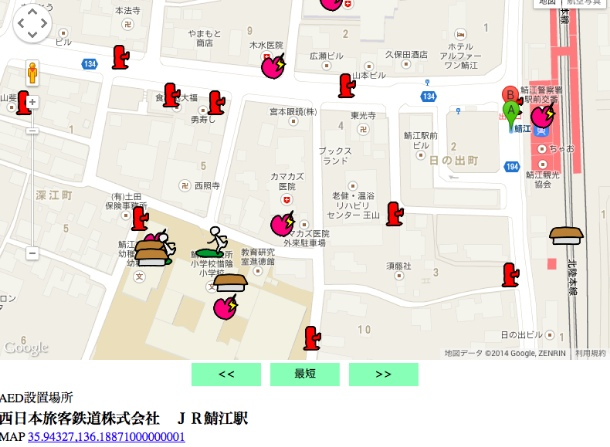

# findsomething

日本のオープンデータプラットフォーム（ODP）を活用し、避難所、AED、公共施設など、周辺の施設や地点（POI）を検索して地図上に表示するウェブアプリケーションです。

## デモ

**~~https://taisukef.github.io/findsomething/**~~ *(unavailable)*

## 機能

- ユーザーの位置情報を自動的に検出し、周辺の施設（POI）を表示します。
- 多言語対応: 日本語、英語、中国語、韓国語、ドイツ語、カタロニア語、ポルトガル語、タガログ語、ペルシャ語。
- さまざまな種類の施設を独自のアイコンで表示:
    - 公共施設
    - 避難所
    - 農産物直売所
    - AED設置場所
    - 公衆トイレ
    - 消火栓
    - 医療機関
- 現在地から最も近い施設を計算し、優先的に表示します。

## セットアップ

このプロジェクトをローカルで実行するには、Google Maps APIキーが必要です。

1. このリポジトリをローカルマシンにクローンします。
2. [Google Cloud Console](https://console.developers.google.com/projectselector/apis/credentials) からGoogle Maps APIキーを取得します。
3. `lib/gmap.js` ファイルを開き、`API_KEY` のプレースホルダ値を自身のキーに置き換えます。
4. モダンブラウザで `index.html` を開きます。

## データソース

- **データ:** [オープンデータプラットフォーム（ODP）SPARQL API](https://sparql.odp.jig.jp/data/sparql)
- **マッピング:** Google Maps JavaScript API

## クレジット

このプロジェクトは [福野泰介](http://fukuno.jig.jp/) によって作成されました。

## ライセンス

このプロジェクトはMIT Licenseの下でライセンスされています。詳細は [LICENSE](LICENSE) ファイルをご覧ください。
